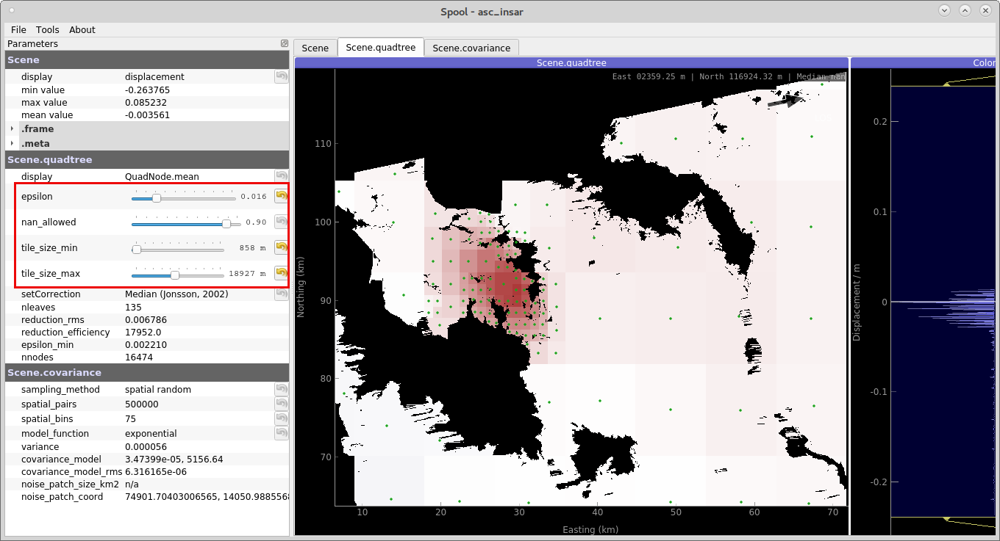
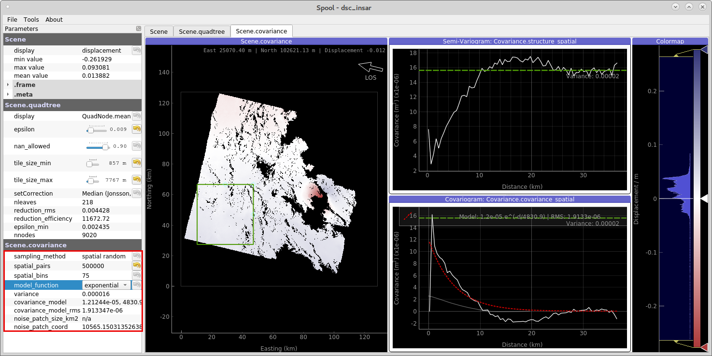
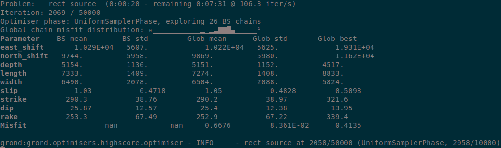

Rectangular source plane from InSAR observations
------------------------------------------------

This step-by-step recipe will guide you to through an earthquake source inversion for a finite rectangular fault plane from InSAR data using Grond. We will excercise the inversion for the 2009 L'Aquila earthquake - A shallow normal faulting Mw 6.3 earthquake - and use unwrapped surface displacement data derived from the Envisat mission.

Setup
.....

To repeat this exercise on your machine, you should first `install Pyrocko
<https://pyrocko.org/docs/current/install/>`_ and Grond (see :doc:`/install/index`), if you have not already done so. Then, copy the
exercise project directory from Grond's git repos to a place of your choice.

.. code-block :: sh

    # git clone https://gitext.gfz-potsdam.de/heimann/grond.git  # <- done during installation
    cp -r grond/examples/grond-playground-insar ~/grond-playground-insar
    cd ~/grond-playground-insar

The project folder
..................

The project folder now contains a configuration file for Grond, some utility scripts to download precalculated Green's functions and InSAR data

.. code-block :: sh
    
    grond-playground-insar        # project folder
    ├── bin                        # directory with scripts
    │   ├── download_gf_stores.sh  # download precalculated Green's functions
    │   ├── download_insar_data.sh      # a simple event-based waveform downloader
    └── config                     # directory for configuration files
        └── insar_rectangular.gronf       # Grond configuration file for this exercise

Green's function download
.........................

To download the precalculated Green's functions needed in this exercise, run

.. code-block :: sh
    
    bin/download_gf_stores.sh

It contains a Pyrocko Green's function store, named ``crust2_ib_static``, which has been created using the `Fomosto <https://pyrocko.org/docs/current/apps/fomosto/index.html>`_ tool of `Pyrocko <http://pyrocko.org/>`_ and the modelling code `QSSP <https://pyrocko.org/docs/current/apps/fomosto/backends.html#the-qssp-backend>`_. The Green's functions in this store have been calculated for a regional `CRUST2 <https://igppweb.ucsd.edu/~gabi/crust2.html>`_ earth model for a source depths between 0 and 30 km in 500 m steps, and horizontal extent from 0 - 300 km in 500 m steps.

InSAR displacement download
...........................

The example includes a script to download unwrapped InSAR data from Pyrocko's servers. The sufrface displacement data has been derived from the Envisat satellite mission.

.. code-block :: sh
    
    bin/download_insar_data.sh

This will download (1) an ascending and (2) descending scene to :file:`data/events/2009laquila/insar/`. Data is held in ``kite`` container format.

InSAR data preparation with ``kite``
....................................

The downloaded data has to be prepared for the inversion using the ``kite`` tool. To install the software, follow the `install instructions <https://pyrocko.org/docs/kite/current/installation.html>`_.

Once the software is installed we need to parametrize the two scenes:

    1. The data subsampling quadtree. This efficiently reduces the resolution of the scene, yet conserves the important data information. A reduced number of samples will benefit the forward-modelling computing cost.

    2. Estimate the spatial data covariance. By looking at the spatial noise of the scene we can estimate the data covariance. ``kite`` enables us to calculate a covariance matrix for the quadtree, which will be used as a weight matrix in our Grond inversion.

Let's start by parametrizing the quadtree: find a good parameters for the subsampling quadtree by tuning four parameters:

    1. ``epsilon``, the variance threshold in each quadtree's tile.
    2. ``nan_fraction``, percentage of allowed NaN pixels per tile.
    3. ``tile_size_min``, minimum size of the tiles.
    4. ``tile_size_max``, maximum size of the tiles.

Start kite's :program:`spool` GUI with:

.. code-block :: sh

    spool data/events/2009LAquila/insar/asc_insar
    # descending scene:
    spool data/events/2009LAquila/insar/dsc_insar

Now we can parametrize the quadtree visually:

    
    **Figure 1**: Parametrizing the quadtree with :command:`spool`. 

.. note ::
    
    Delete unncessary tiles of the quadtree by right-click select, and delete with :kbd:`Del`.

Once you are done, click on the Tag :guilabel:`scene.covariance`. Now we will define a window for the data's noise. The window's data will be use to calculating the spatial covariance of the scene(for details see: reference).

Use a window far away from the earthquake signal to capture true noise, yet the bigger the window is, the better the data covariance will be estimated.
In figure 2.

On the left hand side of the GUI you find parameters to tune the spatial covariance analysis. We now can fit an analytical model to the empirical covariance: :math:`\exp(d)` and :math:`\exp + \sin`. For more details on the method, see `kite's documentation <https://pyrocko.org/docs/kite/current>`_.

    
    **Figure 2**: Data covariance inspection with :command:`spool`.

Once we finished parametrisation of the quadtree and covariance, we have to calculate the full covariance and weight matrix from the complete scene resoltion:

    1. Calulate the full covariance: :menuselection:`Tools --> Calculate Full Matrix`
    2. Save the parametrized scene: :menuselection:`File --> Save Scene`.

Grond configuration
...................

The project folder already contains a configuration file for rectangular source optimisation with Grond, so let's have a look at it.

It's a `YAML`_ file: This file format has been choosen for the Grond configuration because it can represent arbitrarily nested data structures built from mappings, lists, and scalar values. It also provides an excellent balance between human and machine readability. When working with YAML files, it is good to know that the **indentation is part of the syntax** and that comments can be introduced with the ``#`` symbol. The type markers, like ``!grond.RectangularProblemConfig``, select the Grond object type of the following mapping and it's documentation can likely be found in the :doc:`/library/index`.

.. literalinclude :: ../../../../examples/grond-playground-insar/config/insar_rectangular.gronf
    :language: yaml
    :caption: config/insar_rectangular.gronf (in project folder)

Checking the optimisation setup
...............................

Before running the actual optimisation, we can now use the command

.. code-block :: sh
    
    grond check config/insar_rectangular.gronf gfz2015sfdd

to run some sanity checks. In particular, Grond will try to run a few forward models to see if the modelling works and if it can read the input data. If only one event is available, we can also neglect the event name argument in this and other Grond commands.

Starting the optimisation
.........................

Now we are set to start the optimisation with:

.. code-block :: sh

    grond go config/insar_rectangular.gronf

During the optimisation a status monitor will be presented.

    **Figure 3**: Runtime information given by :command:`grond`.

Depending on the configured number of iterations and the computer's hardware the optimisation will run several minutes to hours.

Optimisation report
...................

Once the optimisation is finished we can generate and open the final report with:

.. code-block :: sh

    grond report -so rundir/rect_source.grun

See the `example report <https://localhost>`_.

.. _Kite: https://pyrocko.org/docs/kite/current/
.. _YAML: https://en.wikipedia.org/wiki/YAML
