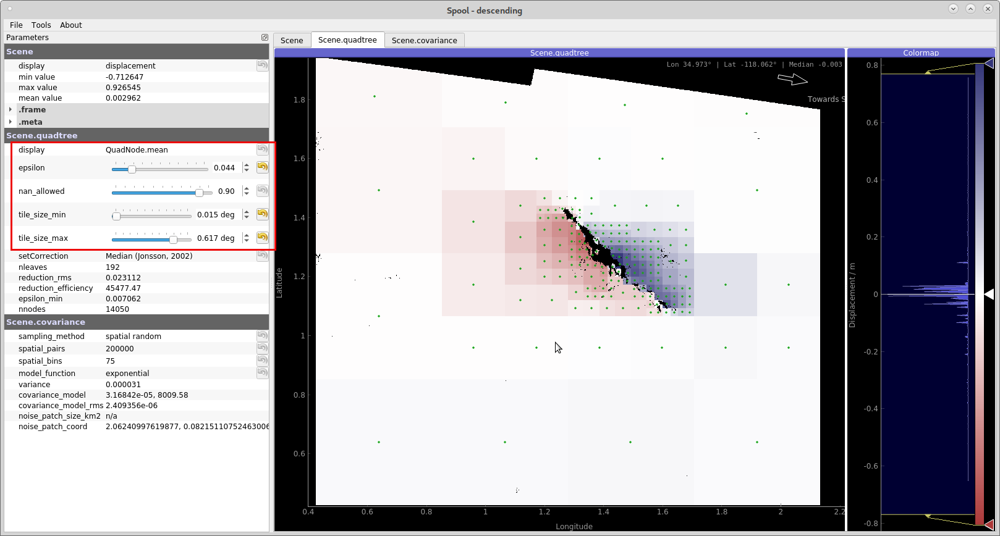
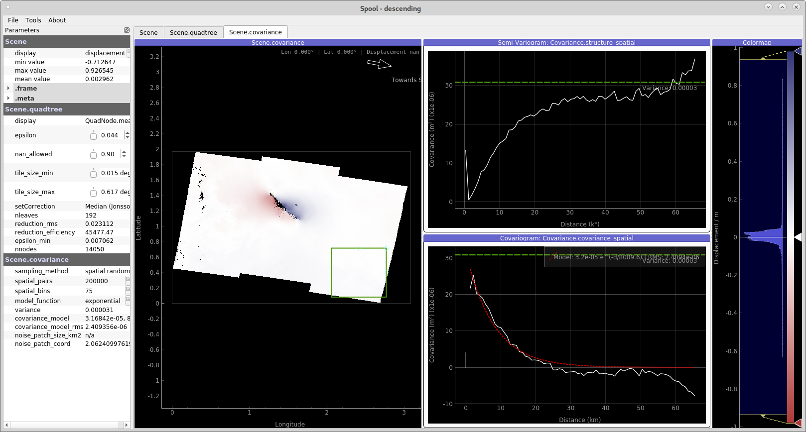
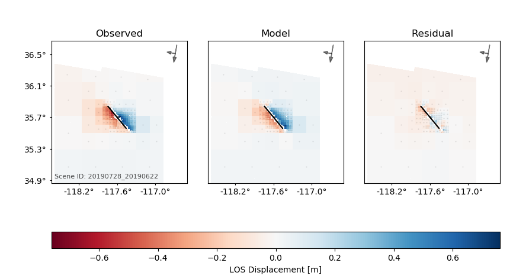

Rectangular source plane from InSAR and GNSS observations
=========================================================

This example will demonstrate a non-linear optimisation of a finite rectangular fault plane using Grond based on static displacement data. Here we use coseismic InSAR and GNSS displacements measured for the 2019 Ridgecrest Earthquake. The InSAR surface displacement data are taken from the `Advanced Rapid Imaging and Analysis (ARIA) Project for Natural Hazards <https://aria.jpl.nasa.gov/>`_ by JPL/NASA. The coseismic GNSS displacements were delivered by `Nevada Geodetic Laboratory <http://geodesy.unr.edu/index.php>`_.

This tutorial will guide through the preparation of the InSAR surface displacements (unwrapped interferograms) in `Kite`_. The GNSS displacement data will be imported into Pyrocko and stations with significant coseismic displacment have been pre-selected.

This is an advanced example to demonstrate a geodetic joined-data non-linear optimisation. If you haven't worked with Grond earthquake optimisations before, we recommend to exercise a single dataset example first (e.g. see `Rectangular source plane from InSAR observations <https://pyrocko.org/docs/grond/docs/current/examples/satellite_insar/>`_).

Setup
-----

To do this exercise on your machine, you should first install Grond (see :doc:`/install/index`), which needs `Pyrocko <https://pyrocko.org/docs/current/install/>`__ and `Kite`_, if you have not already done so. Now create the example project with:

.. code-block :: sh

    grond init example_insar_insar grond-joint-geodetic/

The project folder
------------------

The project folder now contains a configuration file for Grond and some utility scripts to download pre-calculated static Green's functions and the InSAR and GNSS data:

.. code-block :: sh
    
    grond-joint-geodetic             # project folder
    ├── bin                          # directory with scripts
    │   ├── download_gf_stores.sh    # download pre-calculated Green's functions
    │   ├── download_data.sh         # a simple event-based waveform downloader
    └── config                       # directory for configuration files
        └── insar_rectangular.gronf  # Grond configuration file for this exercise

Green's function download
-------------------------

To download the pre-calculated Green's functions needed in this exercise, go into you new grond project folder :file:`grond-joint-geodetic` and run

.. code-block :: sh
    
    ./bin/download_gf_stores.sh

When the command succeeds, you will have a new subdirectory :file:`gf_stores` in your project folder:

.. code-block :: sh

    gf_stores
    └── crust2_ib_static/... # Green's function store

It contains a Pyrocko Green's function store, named ``crust2_ib_static``, which has been created using the `Fomosto <https://pyrocko.org/docs/current/apps/fomosto/index.html>`_ tool of `Pyrocko <http://pyrocko.org/>`_ and the static modelling code `PSGRN/PSCMP <https://pyrocko.org/docs/current/apps/fomosto/backends.html#the-psgrn-pscmp-backend>`_. The Green's functions in this store have been calculated for a regional `CRUST2 <https://igppweb.ucsd.edu/~gabi/crust2.html>`_ earth model for source depths between 0 and 30 km in 500 m steps, and horizontal extent from 0 - 300 km in 500 m steps. Find more information on the Green's function and their use in the `Pyrocko-GF section <https://pyrocko.org/docs/current/topics/pyrocko-gf.html>`_.

InSAR and GNSS data download
----------------------------

This example includes a script to download InSAR and GNSS data from Pyrocko's servers. The InSAR data are surface displacement maps based on unwrapped Sentinel-1 interferograms provided by `ARIA (NASA) <https://aria.jpl.nasa.gov/>`_. An example how to download and convert ARIA data in `Kite`_ can be followed in the `documentation <https://pyrocko.org/docs/kite/>`_. Download the data by running:

.. code-block :: sh
    
    ./bin/download_data.sh

The InSAR and GNSS data are placed in :file:`data/events/2019-ridgecrest`. InSAR surface displacements are held in the `Kite`_ container format. GNSS data are stored in Pyrocko containers in a human-readable `YAML`_ format and we use them as they are.

InSAR data post-processing with Kite
------------------------------------

The downloaded InSAR data have to be prepared for the optimisation with the `Kite tool <https://pyrocko.org/docs/kite/>`_  that you installed previously (see Setup above).

We prepare the two InSAR data sets as follows:

    1. Applying quadtree data sub-sampling: This reduces the resolution of the data in an irregular way, yet enables to conserve the information in  the spatial displacement pattern. The strongly reduced number of data points will strongly reduce the forward-modelling computing costs.

    2. Estimating the spatial data error covariance: We analyse the power and spatial correlation of data noise in areas with little coseismic displacement. Kite uses the error statistics to calculate the data error variance-covariance matrix for the chosen quadtree subsamling. This matrix will be used to derive the weight matrix in our Grond optimisation.

.. note ::
    The scenes come pre-configured. The following steps of defining the quadtree and calculating the covariance matrix are good to exercise.

Load the InSAR data for interactive parametrisation using the `spool` command:

.. code-block :: sh

    spool data/events/2019-ridgecrest/insar/ascending

    spool data/events/2019-ridgecrest/insar/descending

The starting window shows on the right the :guilabel:`Scene` Tab up front. You see the displacement map with some masked areas (low coherence or masked unreliable unwrapping). You can zoom, adjust the colorbar, and find values in the top right corner by pointing the mouse at them. 

**Quadtree subsampling**

To parameterise the quadtree setting we switch to the :guilabel:`Scene.quadtree` Tab and use the sliders on the left to find good parameters for the sub-sampling quadtree. We can tune the following four parameters:

    1. ``epsilon``, the variance threshold in each quadtree's tile.
    2. ``nan_fraction``, percentage of allowed NaN pixels per tile.
    3. ``tile_size_min``, minimum size of the tiles.
    4. ``tile_size_max``, maximum size of the tiles.

    
    **Figure 1**: Parametrising the quadtree. This efficiently sub-samples the high-resolution Sentinel-1 surface displacement data. (command :command:`spool`; `Kite`_ toolbox).

.. tip ::
    
    Delete unnecessary or unwanted tiles of the quadtree by right-click dragging across these areas, and delete with :kbd:`Del`. Unnecessary could be areas far away from the action and unwanted could be quadtrees that cross the potential surface trace of the fault or that are affected by unwrapping errors.

**InSAR data error estimation**

For the data error estimation we switch the tab :guilabel:`Scene.covariance`. Here we define a window that ideally includes data noise. The window's data are used to calculate the variance and spatial covariance of the data noise based on variogram and covariogram (see `details <https://pyrocko.org/kite/docs/current/examples/covariance.html>`_).

Use a spatial window far away from the earthquake signal to capture only the noise. The larger the window is, the longer the analysed noise wavelengths.The variance estimation can be manually adapted by grabbing the green dashed line and move it. The variance should be as large or larger than the covariance at zero distance.

On the left hand side of the GUI you find parameters to tune the spatial covariance analysis.  You can improve the data error estimation by increasing the number of spatial pairs to get smoother (co-)variograms. We now can fit an analytical model to the empirical covariance: :math:`\exp(d)` or :math:`\exp + \sin`. For more details on the method, see `Kite's documentation <https://pyrocko.org/docs/kite/current>`_.

    
    **Figure 2**: Spatial data covariance inspection and definition of the noise window.

Once we finished parametrisation of the quadtree and covariance, we have to calculate the full covariance and weight matrix from the complete scene resolution:

    1. Calculate the full covariance: :menuselection:`Tools --> Calculate Full Matrix`
       Depending on the scene's resolution this process can take time.
    2. Save the parametrised scene: :menuselection:`File --> Save Scene`.

Grond configuration
-------------------

The project folder already contains a configuration file for a rectangular source optimisation with Grond, so let's have a look at it.

It's a `YAML`_ file: This file format has been chosen for the Grond configuration because it can represent arbitrarily nested data structures built from mappings, lists, and scalar values. It also provides an excellent balance between human and machine readability. When working with YAML files, it is good to know that the **indentation is part of the syntax** and that comments can be introduced with the ``#`` symbol. The type markers, like ``!grond.RectangularProblemConfig``, select the Grond object type of the following mapping and it's documentation can likely be found in the :doc:`/library/index`.

.. literalinclude :: ../../../../examples/example_insar_gnss/config/insar_rectangular.gronf
    :language: yaml
    :caption: config/insar_rectangular.gronf (in project folder)

Checking the optimisation setup
-------------------------------

Before running the actual optimisation, we can now use the command

.. code-block :: sh
    
    grond check config/insar_rectangular.gronf

to run some sanity checks. In particular, Grond will try to run a few forward models to see if the modelling works and if it can read the input data. If only one event is available, we can also neglect the event name argument in this and other Grond commands.

Starting the optimisation
-------------------------

Now we are set to start the optimisation with:

.. code-block :: sh

    grond go config/insar_rectangular.gronf

During the optimisation a status monitor will show the optimisation's progress.

.. raw:: html
    
    

Depending on the configured number of iterations and the computer's hardware the optimisation will run several minutes to hours.

Optimisation result report
--------------------------

Once the optimisation is finished we can generate and open the final report with:

.. code-block :: sh

    grond report -so runs/rectangular_2019ridgecrest.grun

    
    **Figure 3**: Surface displacements from the ascending track. (Left) the observed InSAR data, (center) the modelled surface displacements, and (right) the residual displacement. More information, statistics and plots are accessible in the complete optimisation report.

Example report
~~~~~~~~~~~~~~

Explore the `online example reports <https://pyrocko.org/grond/reports>`_ to see what information the optimisation reveals.

.. _Kite: https://pyrocko.org/docs/kite/current/
.. _YAML: https://en.wikipedia.org/wiki/YAML

