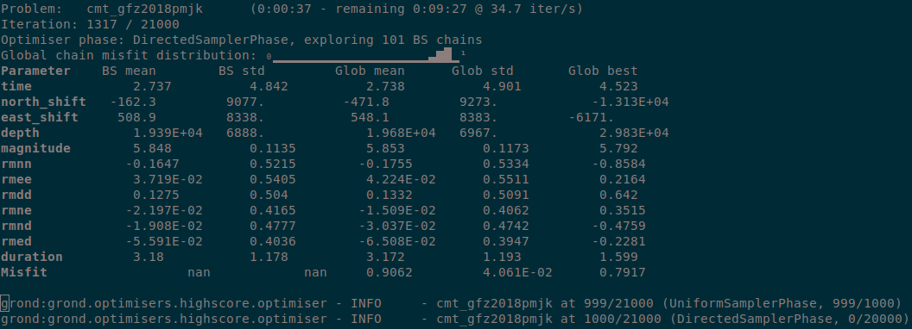

Centroid moment tensor from regional surface wave observations
==============================================================

This step-by-step guide explains how to obtain a probabilistic centroid moment tensor (CMT) solution from surface waves for an `Mw 5.9 aftershock <https://geofon.gfz-potsdam.de/eqinfo/event.php?id=gfz2018pmjk>`_ of the Mw 6.9 2018 Indonesia earthquake using Grond.

Setup
-----

To repeat this exercise on your machine, you should first `install Pyrocko <https://pyrocko.org/docs/current/install/>`_ and Grond (see :doc:`/install/index`), if you have not already done so. Then create the example project with:

.. code-block :: sh

    grond init example_regional_cmt grond-playground-regional/

The project folder
------------------

The project folder now contains a configuration file for Grond, some utility scripts to download pre-calculated Green's functions and to download seismic waveforms from public data centres.

.. code-block :: sh
    
    grond-playground-regional  # project folder
    ├── bin                         # directory with scripts
    │   ├── download_gf_stores.sh   # download pre-calculated Green's functions
    │   ├── grondown                # a simple event-based waveform downloader
    │   └── grondown_regional.sh    # downloader configured for this exercise
    └── config                      # directory for configuration files
        └── surface_cmt.gronf       # Grond configuration file for this exercise

Green's function download
-------------------------

To download the pre-calculated Green's functions needed in this exercise, run

.. code-block :: sh
    
    bin/download_gf_stores.sh

When the command succeeds, you should have a new subdirectory :file:`gf_stores` in your project folder:

.. code-block :: sh

    gf_stores
    └── crust2_j3/... # Green's function store

It contains a Pyrocko Green's function store, named ``crust2_j3``, which has been created using the `Fomosto <https://pyrocko.org/docs/current/apps/fomosto/index.html>`_ tool of `Pyrocko <http://pyrocko.org/>`_ and the modelling code `QSEIS <https://pyrocko.org/docs/current/apps/fomosto/backends.html#the-qseis-backend>`_. The Green's functions in this store have been calculated for a regional `Crust2x2 <https://igppweb.ucsd.edu/~gabi/crust2.html>`_ earth model for a source depths between 0 and 30 km in 1 km steps. It is sampled at 2 Hz, which is sufficient for our target frequency range of 0.01 - 0.1 Hz.

Seismic waveform data download
------------------------------

A preconfigured script is provided to download seismic waveform recordings via FDSN web services from the `IRIS <http://service.iris.edu/fdsnws/>`_ and `GEOFON <https://geofon.gfz-potsdam.de/waveform/webservices.php>`_ data centers. Just run it with the GEOFON event ID of the study earthquake. The GEOFON event ID of the Mw 5.9 aftershock is ``gfz2018pmjk`` (you can find the ID in the `GEOFON catalog <https://geofon.gfz-potsdam.de/eqinfo/list.php>`_ event links).

To download the seismic waveform data, now run:

.. code-block :: sh
    
    bin/grondown_regional.sh gfz2018pmjk

This shell script calls the data downloader :file:`bin/grondown` with parameters appropriate to get a dataset of broadband seismometer recordings, sufficient for a surface wave CMT optimisation. It performs the following steps for us:

* Query the `GEOFON catalog <https://geofon.gfz-potsdam.de/eqinfo/list.php>`_ for event information about ``gfz2018pmjk``.
* Select time windows based on event origin and time, considering that we want to analyse the signals at low frequencies (0.01 - 0.1 Hz).
* Query data centres for seismic stations with epicentral distance between 0 and 1000 km.
* From the available recorder channels select appropriate ones for a target sampling rate of 2 Hz.
* Download raw waveform data for the selected stations and channels.
* Download instrument transfer function meta-information for all successfully downloaded waveform data.
* Calculate displacement seismograms for quality check (Grond will use the raw data). If all went well, the displacement seismograms should be valid in the frequency range 0.01 - 0.05 Hz, sampled at 1 Hz and rotated to radial, transverse, and vertical components. The rotation to radial and transverse components is with respect to the event coordinates from the GEOFON catalogue.

After running the download script, the playground directory should contain a new :file:`data` directory with the following content:

.. code-block :: sh

    data
    └── events
        └── gfz2018pmjk
            ├── event.txt                 # catalogue information about the event
            └── waveforms
                ├── grondown.command
                ├── prepared/...          # rotated, displacement waveforms
                ├── raw/...               # raw Mini-SEED waveforms
                ├── rest/...
                ├── stations.geofon.xml   # instrument response information
                ├── stations.iris.xml
                ├── stations.orfeus.xml
                ├── stations.prepared.txt # stations files for Snuffler
                └── stations.raw.txt

Because of various data problems, like missing instrument response information, gappy traces, data inconsistencies and what not, only about half of the initially requested stations will be useful in the optimisation. Some problems are not detected by the downloader, so we will have to look at the seismograms.

Data screening
--------------

For a quick visual inspection of the dataset, we can use the `Snuffler <https://pyrocko.org/docs/current/apps/snuffler/index.html>`_ program contained in Pyrocko.

.. code-block :: sh

    cd data/events/gfz2018pmjk/waveforms
    snuffler --event=../event.txt --stations=stations.prepared.txt prepared
    cd -  # change to previous folder

Figure 1 shows our view after some interactive adjustments in Snuffler. In particular, we may want to

* sort the traces according to epicentral distance (Menu → check *Sort by Distance*).
* configure display style (Menu → uncheck *Show Boxes*, check *Common Scale per Station*, uncheck *Clip Traces*).
* filter between 0.01 and 0.05 Hz.
* add markers for expected P phase arrivals, (Menu → *Panels* → *Cake Phase (builtin)*).
* show only vertical components: Command ‣ :command:`c *z`.

.. figure:: ../../images/example_snuffler-gfz2018pmjk.svg
    :name: Fig. 1 Example surface wave CMT inversion
    :width: 100%
    :align: center
    
    **Figure 1**: Displacement seismograms for surface wave CMT optimisation as viewed in the waveform browser Snuffler.

Grond configuration
-------------------

The project folder already contains a configuration file for W-phase CMT
optimisation with Grond, so let's have a look at it. It is a `YAML`_ file. If
you have never heard about this file format, read section
:doc:`/config/structure` for an overview.

.. literalinclude :: ../../../../examples/example_regional_cmt/config/regional_cmt.gronf
    :language: yaml
    :caption: config/regional_cmt.gronf (in project folder)

Configured like this, Grond will try to fit Rayleigh waves in the frequency
range 0.01 to 0.05 Hz on the vertical (Z) and radial (R) components as well as
Love waves on the transverse (T) component of ground displacement. The mismatch
between observation and modelling will be measured using an L1 norm.

.. _YAML: https://en.wikipedia.org/wiki/YAML

Checking the optimisation setup
-------------------------------

Before running the actual optimisation, we can now use the command

.. code-block :: sh
    
    grond check config/regional_cmt.gronf gfz2018pmjk

to run some sanity checks. In particular, Grond will try to run a few forward models to see if the modelling works and if it can read the input data. If only one event is available, we can also neglect the event name argument in this and other Grond commands.

To get some more insight into the setup, we can run

.. code-block :: sh

    grond report -so config/regional_cmt.gronf gfz2018pmjk

This will plot some diagnostic figures, create web pages in a new directory :file:`report`, and finally open these in a web browser.

Starting the optimisation
-------------------------

Let's start the optimisation with:

.. code-block :: sh

    grond go config/regional_cmt.gronf

During the optimisation a status monitor will show the optimisation's progress.

    **Figure 2**: Runtime information given by :option:`grond go`.

Depending on the configured number of iterations and the computer's hardware the optimisation will run several minutes to hours.

Optimisation report
-------------------

Once the optimisation is finished we can generate and open the final report with:

.. code-block :: sh

    grond report -so runs/cmt_gfz2018pmjk.grun

Example report
~~~~~~~~~~~~~~

Explore the `online example reports <https://pyrocko.org/grond/reports>`_ to see what information the inversion reveals.
