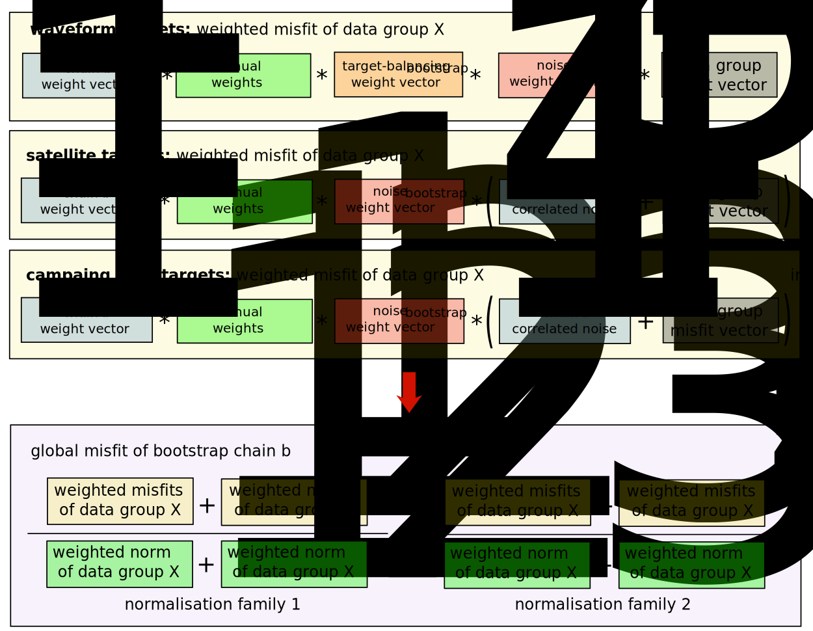
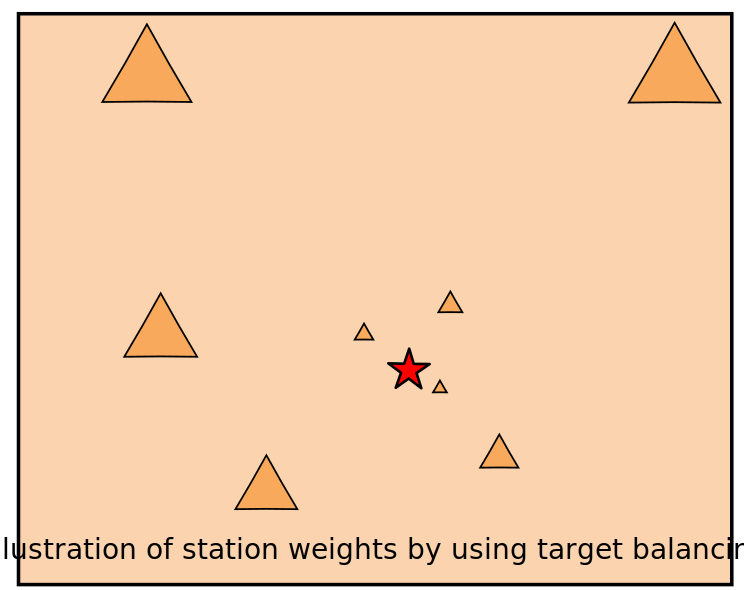
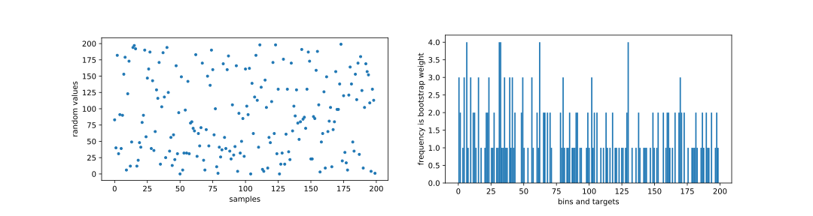
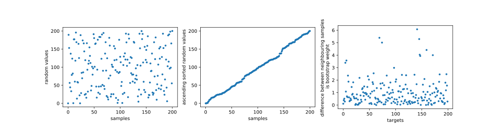
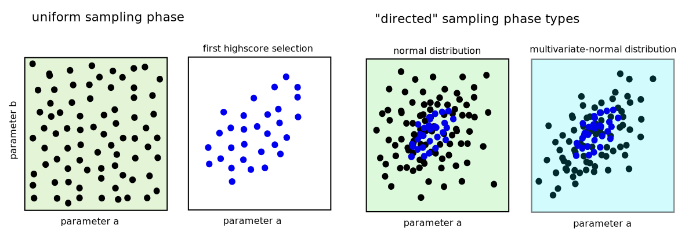
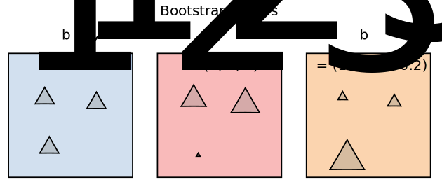
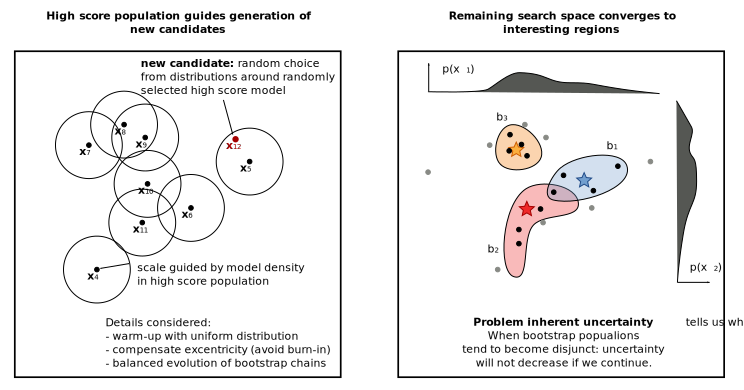

******
Method
******

This document gives a comprehensive overview over Grond's methodical background. It describes how the objective function and data weighting are defined, the optimisation algorithm works and how model uncertainties are
estimated.

The very core of any optimisation is the evaluation of an objective function or misfit value between observed and predicted data. This is most often based on the difference

.. math::
  
  {\bf d}_{\mathrm{obs}} - {\bf d}_{\mathrm{synth}},

but can also be any other comparison, like a correlation measure for instance.

`Observed data` :math:`{\bf d}_{\mathrm{obs}}` are post-processed data (or features) derived from the `raw` measurements. For example, in the context of seismic source inversion, seismic waveforms are tapered to seismic phases of interest, restituted to displacement and filtered. `Predicted data` :math:`{\bf d}_{\mathrm{synth}}` are then modelled seismograms which are tapered and filtered in the same way as the observed waveforms.

.. contents :: Content
  :depth: 3

Forward modelling with pre-calculated Green's functions
=======================================================

The forward modelling of raw synthetic data :math:`{\bf d}_{\mathrm{raw, synth}}` for earthquake source models requires the calculation of the Green's function (GF) between all :term:`source` points and :term:`receiver` positions involved, based on a medium (velocity) model. In the general earthquake :term:`source problem <Problem>`, the positions of the sources change during the optimisation because the misfit is calculated for many different source-receiver configurations. The calculation of the GFs for each specific source-receiver pair is computationally costly and would be a significant contribution to the total computational duration of an optimisation. Therefore, Grond uses pre-calculated GFs, stored in a database called Pyrocko :term:`GF store <Green's Function Store>`. Such GF Stores can be created with the `Fomosto`_ GF management tool of Pyrocko.

Different applications need different types of :term:`GF stores <Green's function store>`. For the purpose of forward modelling in Grond, we have to distinguish between

1. GFs for dynamic seismic waveforms and
2. GFs for static near-field displacement.

Ready to use GF stores can be found in `our online repository <http://kinherd.org/gfs.html>`_. Global GFs for several standard earth models, like e.g. the global 1D `PREM model`_ are available, as well as regional distance GFs for many profiles of the `CRUST 2.0 <https://igppweb.ucsd.edu/~gabi/crust2.html>`_ earth model database. Custom GF stores can be created using the `Fomosto`_ tool and an appropriate choice of the numerical method to calculate the GFs (Fomosto back end).

GFs for seismic waveforms
-------------------------

For regional data analyses the `QSEIS <https://pyrocko.org/docs/current/apps/fomosto/backends.html#the-qseis-backend>`_ method for layered media by `Wang et al.`_ (1999) is appropriate. For global forward models the `QSSP <https://pyrocko.org/docs/current/apps/fomosto/backends.html#the-qssp-backend>`_ method also by `Wang et al.`_ (2017) is more suited.

GFs for static near-field displacements (measured by using GNSS or InSAR)
-------------------------------------------------------------------------

For the calculation of purely static coseismic surface displacements the use of the `PSGRN/PSCMP <https://pyrocko.org/docs/current/apps/fomosto/backends.html#the-psgrn-pscmp-backend>`_ method by `Wang et al.`_ (2006) is suggested for fast forward modelling.

For more details on GF stores, see the `Pyrocko documentation <https://pyrocko.org/docs/current/>`_.

Objective function design
=========================

The `objective function` (or `misfit function`) gives a scalar misfit value how well the source model fits the observed data. A smaller misfit value is better than a large one. The source model that results in the smallest values of the :term:`objective function` is the global minimum of the misfit function optimum model.

The objective function defines what a `model fit` is and how `good` or `poor` models are scaled with respect to others. Furthermore, the objective function has rules how different observed data sets are handled, which `Lp-norm <https://en.wikipedia.org/wiki/Lp_space>`_ is applied and how data errors are considered in optimisations.

    **Figure 1**: Overview of Grond's :term:`objective function` design. Each optimisation :term:`target` (waveform, satellite and campaign GNSS) handles weights similarly and bootstraps differently. Details on how each target and weight vector is formed is described in the section below.

Misfit calculation and objective function
-----------------------------------------

The core of an optimisation is the data-point-wise calculation of the difference between observed and predicted data:

.. math ::

    |{\bf d}_{\mathrm{obs}} - {\bf d}_{\mathrm{synth}}|.

Grond supports different seismological observations and a combination of those, thus :math:`{\bf d}_{\mathrm{obs}}` and :math:`{\bf d}_{\mathrm{synth}}` can be:

* Seismic waveforms
    * in time domain
    * in spectral domain
    * in logarithmic spectral domain
    * trace's spectral ratios

* Static surface displacements
    * from unwrapped InSAR images
    * from pixel offsets
    * measured by using GNSS sensors

The misfit is based on the configurable :math:`L^p`-norm with :math:`p \,\, \epsilon \,\, [1, 2, 3, ...]`:

.. math::
  :label: eq:ms

    \lVert e \rVert_p = \lVert {\bf{d}}_{\mathrm{obs}} - {{\bf d}}_{\mathrm{ synth}} \rVert_p  = \
        \left(\sum{|{ d}_{\mathrm{obs}, i} - {d}_{\mathrm{ synth}, i}|^p}\right)^{\frac{1}{p}}

Further the misfit normalisation factor :math:`norm` is associated with each target. This measure will be used to normalise the misfit values for relative weighting:

.. math::
  :label: ns

    \lVert e_{\mathrm{0}} \rVert_p = \lVert {\bf{d}}_{\mathrm{obs}} \rVert_p  = \left(\sum{|{d}_{\mathrm{obs},i}|^p} \right)^{\frac{1}{p}}.

The resulting normalised misfit

.. math::
  :label: ms_ns

    \lVert e_{\mathrm{norm}} \rVert_p = \
    \frac{\lVert e \rVert_p}{ \lVert e_{\mathrm{0}} \rVert_p}.

is a useful measure to evaluate the data fit. Model predictions that manage to explain parts of the observed data holds :math:`\lVert e_{\mathrm{norm}} \rVert_p <1`. Furthermore, the data norm :math:`\lVert e_{\mathrm{0}} \rVert_p` is used in the normalisation of data groups.

Waveform misfit
^^^^^^^^^^^^^^^

Waveform data is preprocessed before misfit calculation: Before the misfit is calculated, observed and synthetic data are tapered within a time window and bandpass filtered (see above).
The misfit in Grond can further be based on the maximum waveform correlation.

When measuring waveform data's cross-correlation, the misfit function is based on the maximum correlation :math:`\mathrm{max}(C)` of :math:`{\bf d}_{\mathrm{obs}}` and :math:`{\bf d}_{\mathrm{synth}}` defined as:

.. math::
  :label: cor

  \begin{align*}
    e_{\mathrm{cc}} = \frac{1}{2} - \frac{1}{2}\, \mathrm{max}(C), \, \
    \mathrm{with} \,\,\,
    e_{\mathrm{0, cc}} = \frac{1}{2} \,\, ,\, \mathrm{such\,\, that}  \
    e_{\mathrm{norm}} = 1 - \mathrm{max}(C).
  \end{align*}

Satellite misfit
^^^^^^^^^^^^^^^^

The surface deformation data is pre-processed with kite (See example project: :doc:`../examples/satellite_insar/index`) to obtain a subsampled quadtree. The misfit is then calculated for each quadtree tile :math:`d_{i}`.

GNSS misfit
^^^^^^^^^^^^

Each GNSS component (north, east and up) is forward modelled and compared with the observed data.

Target Weighting
----------------

Grond implements several different kinds of weights:

* :math:`w_{\mathrm{tba},i}` - target balancing (for waveforms and GNSS campaign only).
* :math:`w_{\mathrm{noise},i}` - noise-based data weights (for waveforms only).
* :math:`w_{\mathrm{man},i}` - user-defined, manual weights of target groups.
* normalisation within data groups, leads to balancing between data groups.

These weights are applied as factors to the misfits, optionally as a product of weight combinations. E.g. for a waveform all data weights combined means:

.. math::
  :label: wcomb

   w_{\mathrm{comb},i} = w_{\mathrm{tba},i} \cdot w_{\mathrm{noise},i} \
   \cdot w_{\mathrm{man},i}

The misfit and data norm calculations with data weights
:math:`w_{\mathrm{comb},i}` change to:

.. math::
  :label: wms_wns

  \begin{align*}
    \lVert e \rVert_x &= \left(\sum{ ({w_{\mathrm{comb},i}} \cdot |{{d}}_{\mathrm{obs},i} - \
  {{ d}}_{\mathrm{synth},i}|)^{x}}\right)^{\frac{1}{x}}\\
    \lVert e_{\mathrm{0}} \rVert_x  &= \left(\sum{ ({w_{\mathrm{comb},i}} \cdot \
       |{{d}}_{\mathrm{obs},i} |)^{x}}\right)^{\frac{1}{x}}
  \end{align*}

Target balancing weights
^^^^^^^^^^^^^^^^^^^^^^^^

With these weights waveform targets are `balanced` with respect to the expected earthquake signal amplitude.

    **Figure 2**: Qualitative sketch how target balancing weight increases with source-receiver distance to balance amplitude inferred by geometrical spreading. Large triangles indicate larger weights and vice versa.

Signal amplitudes in a trace :math:`|{\bf{d}}_{\mathrm{synth}}|_l` depend on the (1) source-receiver distance, (2) on the phase type and (3) the signal processing applied (taper or bandpass). The problem tackled with this particular weight is that large signal amplitudes have higher contributions to the misfit than smaller signals, without providing more information about the source mechanism. From synthetic waveforms of `N` forward models that have been randomly drawn from the defined model space the mean signal amplitude of the traces is derived. The weight for each trace is then the inverse of these mean signal amplitudes:

    .. math::
      :label: wtba

      {\bf w}_{\mathrm{tba}}=\frac{1}{{\bf a}},\quad \textrm{with trace weights}\,\,a_l= \frac{1}{N} \sum^N_j{|{\bf d}_{\mathrm{synth}}|_{jl}}.

These balancing weights will enhanced small signals and supress large signals in the objective function. This is described as `adaptive station weighting` in the PhD `thesis by Heimann`_ (2011) (page 23). In Grond they are defined as ``balancing weights`` and are received from the :class:`~grond.analysers.target_balancing.TargetBalancingAnalyser` module before the optimisation.

Data weights based on data error statistics
^^^^^^^^^^^^^^^^^^^^^^^^^^^^^^^^^^^^^^^^^^^^

There are direct data weight vectors :math:`\bf{w}` or weight matrices :math:`\bf{W}` based on empirical data error variance estimates. Partly, e.g. for InSAR and GNSS data, these weights are derived from data error correlations expressed in the data error variance-covariance matrix :math:`\bf{\Sigma}`:

    .. math::
      :label: wnoi

      {\bf w} = \frac{1}{{\bf \sigma}}, \quad  \bf{W} = \sqrt{{\bf \Sigma}^{-1}}.

For a :class:`~grond.targets.waveform.WaveformTargetGroup` the data error statistics stem from real data noise before the first phase arrival as described e.g. in `Duputel et al.`_ (2012). From the noise traces the inverse of their standard deviation is used. In Grond they are named `station_noise_weights` and are received from the :class:`~grond.analyser.noise_analyser.NoiseAnalyser` before the optimisation. 
In the current grond version, the noise variance and expected target signal (see
``target balancing`` above) are multiplied, and not added, which would be more correct.
We propose to use the :class:`~grond.analyser.noise_analyser.NoiseAnalyser` to
take out very noisy stations using the options ``mode='weeding'`` and a corresponding 
``cutoff`` factor.

For a :class:`~grond.targets.satellite.SatelliteTargetGroup` the data error statistics are pre-calculated by `Kite`_ and loaded with the scenes. The estimation of the noise statistics has to be done before Grond by using `Kite`_. In `Kite`_ the noise estimation can be done in areas of the displacement map that are not affected by coseismic deformation by using spatial sampling methods and semi-variogram and covariogram formation, described e.g. in `Sudhaus and Jonsson`_ (2009).

For a :class:`~grond.targets.gnss_campaign.GNSSCampaignTargetGroup` the data error statistics are also obtained from the data set. They have to be estimated before and given in the GNSS data `YAML`-file describing the data set. For details visit the corresponding chapter in the `Pyrocko tutorial`_.

Manual data weighting
^^^^^^^^^^^^^^^^^^^^^

User-defined manual data weights enable an arbitrary weighting of data sets in contrast to balancing of single observations through target balancing and noise-based data weights. No rules apply other than from the user's rationale. In Grond they are called ``manual_weight`` and are given in the configuration file of the `targets config`_.

Normalisation of data and data groups
-------------------------------------

The normalisation in Grond is applied to data groups that are member of the so called ``normalisation_family``. A `normalisation family` in Grond can be composed in many ways. However, it is often meaningful to put data of the same kind and with similar weighting schemes into the same `normalisation family` (see also Fig. 1). This could be P and S waves, or two InSAR data sets. As an explanation some examples are given here:

Example 1: Fitting waveforms of P and S waves
^^^^^^^^^^^^^^^^^^^^^^^^^^^^^^^^^^^^^^^^^^^^^

Let's say we use the waveform fit in time domain and in spectral domain combined. We then have weighted misfits as in Equation :eq:`wms_wns` for P waves with :math:`{\bf d}_{\mathrm{obs,Pt}}` and :math:`{\bf d}_{\mathrm{synth,Pt}}` in time domain and :math:`{\bf d}_{\mathrm{obs,Ps}}` and :math:`{\bf d}_{\mathrm{synth,Ps}}` in spectral domain. We have also the corresponding weighted misfit norms (see Equation :eq:`wms_wns`) and the same for S waveforms in time and spectral domain. Let's also say we are using the :math:`L^2\,`-norm.

The waveforms of P and S waves in time domain are of a similar and kind and can, maybe even should, be normalised together. The same may be meaningful for the normalisation of the P and S waves in spectral domain. In our formulations the combined targets form combined vectors, e. g. :math:`{\bf d}_{\mathrm{obs,time}} = ({\bf d}_{\mathrm{obs,Pt}}, {\bf d}_{\mathrm{obs,Ps}})`.

In Grond we say the time- domain data and the spectral-domain data each belong to a different ``normalisation_family``. Hence, in this example, there are two normalisation families (:math:`N_{\mathrm{norm\_fams}}=2`). The global misfit of models that reduce the data variance
is constrained to be smaller than 1. The number of normalisation families is
accounted for in the global misfit calculation accordingly.

The **global misfit** for two normalisation families will read:

.. math::
  :label: norm_ex1

  
    \lVert e_{\mathrm{norm,\,global}} \rVert_{2} = \sqrt{
    \frac{ \left( \frac{ \lVert e_{\mathrm{time}} \rVert_2}{\lVert \
       e_{\mathrm{0,time}} \rVert_2}\right)^2 + \
       \left( \frac{ \lVert e_{\mathrm{spectral}} \rVert_2}{\lVert \
        e_{\mathrm{0,spectral}} \rVert_2  }\right)^2 }{ \
             \left( \frac{ \lVert e_{\mathrm{0,time}} \rVert_2}{\lVert \
             e_{\mathrm{0,time}}\rVert_2}\right)^2 + \
             \left( \frac{ \lVert e_{\mathrm{0,spectral}} \rVert_2}{\lVert \
             e_{\mathrm{0,spectral}}\rVert_2}\right)^2 }} = \
              \sqrt{ \frac{ \left( \frac{ \lVert e_{\mathrm{time}} \rVert_2}{ \
              \lVert e_{\mathrm{0,time}} \rVert_2}\right)^2 + \
               \left( \frac{ \lVert e_{\mathrm{spectral}} \rVert_2}{\lVert \
               e_{\mathrm{0,spectral}} \rVert_2  }\right)^2 \
               }{ N_{\mathrm{norm\_fams}} }}

Example 2: Fitting waveforms of P waves and static surface displacements
^^^^^^^^^^^^^^^^^^^^^^^^^^^^^^^^^^^^^^^^^^^^^^^^^^^^^^^^^^^^^^^^^^^^^^^^

Let's say we use P waveforms in the time domain :math:`{\bf d}_{obs,\mathrm{Pt}}`. We combine the waveform misfit defined in Equation :eq:`wms_wns` with the misfit of the maximum waveform  correlation defined in Equation :eq:`cor`. Furthermore we use InSAR-measured static surface displacements  :math:`{\bf d}_{\mathrm{obs,insar}}` and GNSS-measured static surface displacements :math:`{\bf d}_{\mathrm{obs, gnss}}`. The static surface displacement misfit is defined as in Equation :eq:`wms_wns`. InSAR and GNSS targets should commonly be combined in
one normalisation family such that :math:`{\bf d}_{\mathrm{obs,static}} = ({\bf d}_{\mathrm{obs,insar}}, {\bf d}_{\mathrm{obs,gnss}})`.

The waveform misfits and the correlations, even if the same weights are applied, are measures of a different nature. Also the dynamic waveforms and the static near-field displacements have different relationships to the source parameters. Different normalisation is meaningful. The static surface displacement data themselves should be comparable, even though InSAR and GNSS positing are very different measuring techniques.

In this example we have four target groups that form normalizations families.
The **global misfit** in this example is then:

.. math::
  :label: norm_ex2

    \lVert e_{\mathrm{norm,\,global}} \rVert_{2} = \sqrt{
    \frac{ \left( \frac{ \lVert e_{\mathrm{time}} \rVert_2}{\lVert \
       e_{\mathrm{0,time}} \rVert_2}\right)^2 + \
        \left( \frac{ \lVert e_{\mathrm{cc}} \rVert_2}{\lVert \
       e_{\mathrm{0,cc}} \rVert_2}\right)^2 + \
       \left( \frac{ \lVert e_{\mathrm{static}} \rVert_2}{\lVert \
        e_{\mathrm{0,static}} \rVert_2  }\right)^2 }{ \
             \left( \frac{ \lVert e_{\mathrm{0,time}} \rVert_2}{\lVert \
             e_{\mathrm{0,time}}\rVert_2}\right)^2 + \
              \left( \frac{ \lVert e_{\mathrm{0,cc}} \rVert_2}{\lVert \
             e_{\mathrm{0,cc}}\rVert_2}\right)^2 +\
             \left( \frac{ \lVert e_{\mathrm{0,static}} \rVert_2}{\lVert \
             e_{\mathrm{0,static}}\rVert_2}\right)^2 }},

which is in principle:

.. math::
  :label: norm_ex3

    \lVert e_{\mathrm{norm,\,global}} \rVert_{2} = \
              \sqrt{ \frac{ \left( \frac{ \lVert e_{\mathrm{time}} \rVert_2}{ \
              \lVert e_{\mathrm{0,time}} \rVert_2}\right)^2 + \
              \left( \frac{ \lVert e_{\mathrm{cc}} \rVert_2}{ \
              \lVert e_{\mathrm{0,cc}} \rVert_2}\right)^2 + \
               \left( \frac{ \lVert e_{\mathrm{static}} \rVert_2}{\lVert \
               e_{\mathrm{0,static}} \rVert_2  }\right)^2 \
               }{ N_{\mathrm{norm\_fams}} }}.

The bootstrap method
====================

`Bootstrapping` in Grond (see also `Bootstrapping [Wikipedia] <https://en.wikipedia.org/wiki/Bootstrapping_(statistics)>`_)  enables to suppress some types of bias in the optimization results. Observations that are affected by other signals or noise often show large misfits. Also insufficient media models for the forward model can result in high misfit values. Already a few high misfit values may pull the optimisation to a biased optimum. With bootstrapping techniques we can better estimate model parameter uncertainties in an efficient way. These include the propagation of the data error, but also the assessment of modelling errors to some extent.

In Grond the bootstrapping is applied in a number of parallel `bootstrapping chains` where individual bootstrap weights and bootstrap noise is applied to the model misfits. Technically each bootstrap chain carries out its optimization. Find more detail below, at :ref:`babo_optimiser`. (What is an :term:`optimiser`?)

In Grond **two** different bootstrapping methods are implemented:

    1. `Bayesian and classic bootstrapping` through misfit weighting and
    2. `Residual bootstrapping` by adding synthetic noise to the residuals (Fig. 1).

Bayesian bootstrapping
----------------------

These bootstrap types are based on residual weighting. We divert from the physics-related and noise-related target weights and create numerous additional random weight factors for each target. Virtually equal weights of 1 for each target are redistributed to new random weights, which add up to equal the number of targets. In this way the final misfit values are comparable even without normalisation.

Classic weights
^^^^^^^^^^^^^^^

For a `classic` bootstrap realisation we draw :math:`N_{\mathrm{targets}}` random integer numbers :math:`{\bf r} \, \in \, [0, N_{\mathrm{targets}}]` from a uniform distribution (Fig. 2, left). We then sort these in :math:`N_{\mathrm{targets}}` bins (Fig. 2, right). The frequency in each bin forms the bootstrap target weights.

    **Figure 3**: Formation of `classical` bootstrap weights. Uniformly random samples (left) and the corresponding histogram (right) with the occurrence frequencies being used as bootstrap weights.

Bayesian weights
^^^^^^^^^^^^^^^^

For a `Bayesian` bootstrap realisation we draw :math:`N_{\mathrm{targets}}` random real numbers :math:`{\bf r} \, \in \, [0, N_{\mathrm{targets}}]` from a uniform distribution (Fig. 4, left). We then sort the obtained random values in an ascending order and ensure :math:`r_1 = 0` (Fig. 4, middle). The bootstrap weight now is the difference between two samples (Fig. 4, right):

.. math::

  w_{\mathrm{bootstr},\,i}=r_{i+1}-r_i

    **Figure 4**: Formation of `Bayesian` bootstrap weights. Uniformly random samples (left) are sorted (middle) and the differences of neighbouring points (right) are being used as bootstrap weights.

Residual bootstrap
------------------

Residual bootstrapping is a computationally more efficient implementation of the `Randomize-then-optimize`_ approach: with empirical estimates of the data error statistics individual realisations of synthetic correlated random noise are systematically added to the data to obtain perturbed optimisations results (Fig. 5).

Earthquake source parameter distributions retrieved with the `Randomize-then-optimize`_ method based on the data error variance-covariance matrices have been shown to match the model parameter distributions obtained through `Markov Chain Monte Carlo` sampling of the model space (`Jonsson et al.`_, 2014). In our `residual bootstrapping` method we add realisations of synthetic correlated random noise to each bootstrapping chain (Fig. 5C and 1). This reduces the calculation of many independent forward models compared to `Randomize-then-optimize`_ approach.

To generate random noise we use functions of the `Kite`_ module. From the noise estimation region defined in the `Kite`_ scenes (Fig. 5A), the noise power spectrum is used directly with a randomised phase spectrum to create new random noise with same spectral characteristics (Fig. 5B). The noise is then subsampled through the same quadtree as defined for the observed data (Fig. 5C).

.. figure:: ../images/illu_residual_bootstrap_realisation.svg
    :name: Fig. 5
    :width: 100%
    :align: center
    :alt: alternate text
    :figclass: align-center

    **Figure 5**: Residual bootstrapping of InSAR surface displacement data in Grond. (A) From displacements maps we extract noise and (B) synthesise random correlated data noise. (C) This synthetic noise is then subsampled exactly as the observed data. These random realisations are added to the residuals of each bootstrap chain.

.. _optimisation:

Optimisation
============

Grond's modular framework is open for different optimisation schemes, the native optimisation schemes is the so-called `Bayesian Bootstrap Optimisation` (BABO). The :term:`Optimiser` defines the particular :term:`objective function` or objective functions and options for them. The optimiser also defines the model space sampling schemes. Multiple objective functions are realized in parallel running optimisation chains - the bootstrap chains (see below).

.. _babo_optimiser:

Bayesian Bootstrap Optimisation (BABO)
--------------------------------------

Bayesian bootstrap optimisation `BABO <https://de.wikipedia.org/wiki/Babo_(Jugendsprache)>`_ allows for earthquake source optimisation whilst providing the complete information for a fully Bayesian analysis. BABO is based on `Direct Search`, where random model parameters are drawn from a defined model space. Those synthetic models are then calculated and compared with the :term:`target's <target>` observed data. This needs no assumptions on the topology of the misfit space and is appropriate for highly non-linear problems.

BABO can be configured for a simple Monte-Carlo random direct search. It can also resemble a simulated annealing optimisation approach. Last but not least BABO enables fully probabilistic bootstrapping of the optimisation results. This is realised in parallel with optimisation chains to which bootstrapping weights are applied.

.. note ::

  *Weights* are explained above. The specific weighting is configured with the `targets config`_ used and also with the `problem`_. The *model space* in which the optimisation takes place is defined with the `problem`_. Here described is the sampling and in the context of the multiple objective functions given by the bootstrapping.

Sampling scheme and sampling phases
^^^^^^^^^^^^^^^^^^^^^^^^^^^^^^^^^^^

Like in any `direct search` optimisation models are drawn from the model space. From all visited and evaluated models we form and keep a so-called `highscore list`. The sampling is set up to progressively converge to the low-misfit regions efficiently. However, for multi-modal model parameters distributions an efficient sampling can loose sight of multiple minima with significantly low misfits. In Grond we can use measures to nurse these multiple minima.

Highscore list
""""""""""""""
This list contains a defined number of the current best models (lowest misfit). It is continuously updated at runtime. The `highscore` list length :math:`L_{\mathrm{hs}}` (i.e. number of member models) is `problem`_ dependend: :math:`L_{\mathrm{hs}} = f_{\mathrm{len}} (N_{\mathrm{par}} -1)`, with :math:`N_{\mathrm{par}}` being the number of model parameters. :math:`f_{\mathrm{len}}` is configurable (``chain_length_factor``, default is 8).

There are three sampling phases defined, based on which models are drawn from
the model space:

* :class:`~grond.optimisers.highscore.optimiser.UniformSamplerPhase` - models are drawn randomly
* :class:`~grond.optimisers.highscore.optimiser.InjectionSamplerPhase` - allows to inject specific models
* :class:`~grond.optimisers.highscore.optimiser.DirectedSamplerPhase` - existing low-misfit models `direct` the sampling

    **Figure 7**: Strategic sketch of different optimiser sampling phases.

UniformSamplerPhase
"""""""""""""""""""
At the beginning of the optimisation this sampler phase explores the solution space uniformly. A configurable number of models are drawn randomly from the entire model space based on a uniform distribution.

InjectionSamplerPhase
"""""""""""""""""""""
This starting phase allows to inject pre-defined models at the start of the optimisation. These models could originate from a previous optimisation.

DirectedSamplerPhase
""""""""""""""""""""
This sampler is used for the second phase and follows any of starting samplers above: Using existing models of the current `highscore` models the `directed` sampler draws a configurable number of new models. Like this convergence to low-misfit regions is enabled. There are quite some noteworthy configurable details to this sampler phase:

``sampling_distributions``
..........................
New models are drawn from normal distribution. The standard deviations are derived from the `highscore` models parameter's standard deviation and scaled by ``scatter_scale`` (see below). Optionally, the covariance of model parameters is taken into account by configuring when ``multivariate_normal`` is enabled (default is ``normal`` distribution). The distribution is centred around

1. ``mean`` of the `highscore` model parameter distributions
2. a ``random`` model from the `highscore` list or
3. an ``excentricity_compensated`` draw (see below).

``scatter_scale``
.................
This scales search radius around the current `highscore` models. With a scatter scale of 2 the search for new models has a distribution with twice the standard deviation as estimated from the current `highscore` list. It is possible to define a beginning scatter scale and an ending scatter scale. This leads to a confining directed search. In other words, the sampling evolves from being more explorative to being more exploitive in the end.

``starting_point``
..................
This method tunes to the center value of the sampler distribution: This option, will increase the likelihood to draw a `highscore` member model off-center to the mean value. The probability of drawing a model from the `highscore` list is derived from distances the `highscore` models have to other `highscore` models in the model parameter space. Eccentricity is therefore compensated, because models with few neighbours at larger distances have an increased likelihood to be drawn.

What's the use? Convergence is slowed down, yes, but to the benefit of low-misfit region represented by only a few models drawn up to the current point.

Let's assume there are two separated groups of low-misfit models in our `highscore` list, with one group forming the 75% majority. In the directed sampler phase the choices of a mean center point for the distribution as well as a random starting point for the sampler distribution would favour new samples in the region of the `highscore` model majority. Models in the low-misfit region may be dying out in the `highscore` list due to favour and related sparse sampling. `eccentricity compensations` can help is these cases and keep models with not significantly higher misfits in the game and in sight.

TODO: correct? too many explanations? Sebastian, here is the perfect place for one of your movies.

Bootstrap chains
----------------

A `bootstrap chain` is a realisation of target bootstrap weights and/or target bootstrap residuals (depending on the targets, Fig. 7A). Therefore each bootstrap chain has a different misfit. With one forward model :math:`N_{\mathrm{bootstrap}}` different `global misfits` are calculated (Fig. 7B). This approach allows many bootstrap chains leeching the same forward models.

The highscore list member models in each bootstrap chain (Fig. 7B) will differ to some extent and therefore different bootstrap chains may converge to different places within the model space (Fig. 7C, Fig. 8). These differences mark the uncertainty of the models with respect to data errors.

    **Figure 7**:  Bootstrap chain graph. (A) Illustration of bootstrap weights, larger triangles indicate higher weight. (B) bootstrap chain highscore lists and (C) their influence on the convergence in the model parameter space due to the individual weighted objective function of each bootstrap chain.

The convergence of model parameters for the models within each bootstrap chain is dependent on the settings of the optimisation, e.g. the setup of parameter bounds, `scatter scale` settings of the `directive sampling phase` and other tunable. With very `exploitive` settings convergence can be forced. However, if the convergence within each bootstrap chain starts to form individual clusters in the model space, further optimisation will not provide significantly better models. In Fig. 8 the area of the `highscore` models of  three bootstrap chains has only little overlap compared to an earlier stage visualised in Fig. 7C.

    **Figure 8**: Drawing new model candidates from the described sampling strategies - the proposal is based on the existing solution space.

Movies: BABO at work
====================

TODO: replace draft text with something meaningful. add figure with toy problem setup.

Toy problem: find best fitting source location in 3D, given noisy 1D distance
measures from 10 observers on the horizontal z=0 plane. Projection to vertical
cross section is shown. Star is true solution. Lines indicate regions of low
misfit.

Single chain
------------

Only upper half-space is searched, problem is unimodal.

.. raw:: html

    <video width="960" height="540" controls>
        <source src="https://pyrocko.org/grond/media/babo/grond_wellposed_unimodal_lownoise_0_nce_sdac_web.mp4" type="video/mp4">
        Your browser does not support the video tag.
    </video>

Global + 3 bootstrap chains
---------------------------

.. raw:: html

    <video width="960" height="540" controls>
        <source src="https://pyrocko.org/grond/media/babo/grond_wellposed_unimodal_lownoise_3_nce_sdac_web.mp4" type="video/mp4">
        Your browser does not support the video tag.
    </video>

Ill-posed problem, no eccentricity correction
---------------------------------------------

.. raw:: html

    <video width="960" height="540" controls>
        <source src="https://pyrocko.org/grond/media/babo/grond_illposed_unimodal_lownoise_3_nce_mdsc_web.mp4" type="video/mp4">
        Your browser does not support the video tag.
    </video>

Ill-posed problem, eccentricity correction applied
--------------------------------------------------

.. raw:: html

    <video width="960" height="540" controls>
        <source src="https://pyrocko.org/grond/media/babo/grond_illposed_unimodal_lownoise_3_ce_mdsc_web.mp4" type="video/mp4">
        Your browser does not support the video tag.
    </video>

Bimodal, standard deviations from high score models
---------------------------------------------------
Full space is searched, problem is bimodal due to symmetry

.. raw:: html

    <video width="960" height="540" controls>
        <source src="https://pyrocko.org/grond/media/babo/grond_wellposed_bimodal_lownoise_3_ce_sdac_web.mp4" type="video/mp4">
        Your browser does not support the video tag.
    </video>

Bimodal, standard deviations from median density
------------------------------------------------

.. raw:: html

    <video width="960" height="540" controls>
        <source src="https://pyrocko.org/grond/media/babo/grond_wellposed_bimodal_lownoise_3_ce_mdsc_web.mp4" type="video/mp4">
        Your browser does not support the video tag.
    </video>

.. _fomosto: https://pyrocko.org/docs/current/apps/fomosto/index.html
.. _CosTaper: https://pyrocko.org/docs/current/library/reference/trace.html#module-pyrocko.trace
.. _kite: https://pyrocko.org/docs/kite/current/

.. _PREM model: http://ds.iris.edu/spud/earthmodel/9991844
.. _Wang et al.: https://www.gfz-potsdam.de/en/section/physics-of-earthquakes-and-volcanoes/data-products-services/downloads-software/
.. _Duputel et al.: https://academic.oup.com/gji/article/190/2/1243/645429
.. _Sudhaus and Jonsson: https://academic.oup.com/gji/article/176/2/389/2024820
.. _YAML: http://yaml.org/
.. _Pyrocko tutorial: https://pyrocko.org/docs/current/library/examples/gnss_data.html
.. _thesis by Heimann: http://ediss.sub.uni-hamburg.de/volltexte/2011/5357/pdf/Dissertation.pdf
.. _Randomize-then-optimize: https://epubs.siam.org/doi/abs/10.1137/140964023
.. _Jonsson et al.: http://adsabs.harvard.edu/abs/2014AGUFM.S51C..05J

.. _dataset config: ../config/dataset/index.html
.. _targets config: ../config/targets/index.html
.. _problem: problems/index.html
